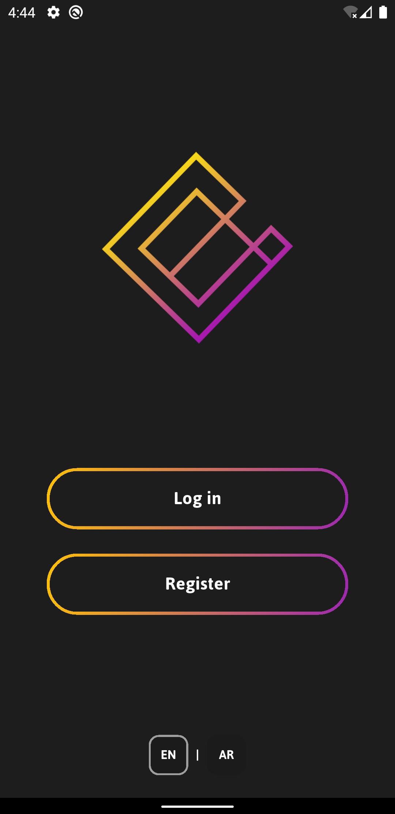

# EXcon - Expert Consultant

## I. Introduction
**EXcon (Expert Consultant)** is a Flutter-based mobile application designed to connect users with experts in various fields for professional consultations. The app allows users to browse experts, reserve appointments, and chat with them seamlessly.

This project was my **first semi-serious university Flutter application**, developed in **2023** during my **third year of university**, after just **two months of learning Flutter**. I designed the UI entirely by myself, without relying on any UI/UX guidelines. Despite that, the app features **smooth animations and a visually appealing interface** for a first serious project.

---

## II. Features
- **Two User Roles**:
  - **Normal Users**: Can search for experts, book consultations, and chat.
  - **Experts**: Can manage appointments and communicate with users.
- **Appointment Booking System**
- **Built-in Chat Functionality**
- **State Management with GetX**
- **Dark Mode & Light Mode Support**
- **Multi-language Support (English & Arabic)**
- **Smooth Animations** for an engaging user experience

---

## III. Technologies Used
- **Flutter** (Framework)
- **Dart** (Programming Language)
- **GetX** (State Management)
- **Firebase** (for authentication and real-time database)
- **Provider** (for some UI-related state handling)

---

## IV. Screenshots
### Dark Mode
<div align="center">
  
  
  
  
  
  
  
  
  
  
</div>

### Light Mode
<div align="center">
  
  
  
  
  
  
  
  
  
  
</div>


---

## V. Installation & Setup
1. **Clone the repository**:
   ```sh
   git clone https://github.com/GhassanJar3850/Excon_Flutter_App.git
   cd Excon
   ```
2. **Install dependencies**:
   ```sh
   flutter pub get
   ```
3. **Run the application**:
   ```sh
   flutter run
   ```

---

## VI. Lessons Learned
- Gained practical experience in **Flutter development** within a short period.
- Learned the importance of **state management** with **GetX**.
- Experimented with **animations and UI design** despite no formal UI/UX experience.
- Built a **multi-language app** with **dynamic theming**.

---

## VII. Future Improvements
- Integrate **payment gateways** for premium consultations.
- Improve **UI/UX** by incorporating professional design principles.
- Enhance **chat features** (voice messages, file sharing, etc.).
- Implement **calendar synchronization** for better appointment management.

---

## VIII. License
This project is licensed under the **MIT License**.

---

## IX. Contributors
I welcome contributions! Feel free to **fork the repo** and submit pull requests to improve the app.

